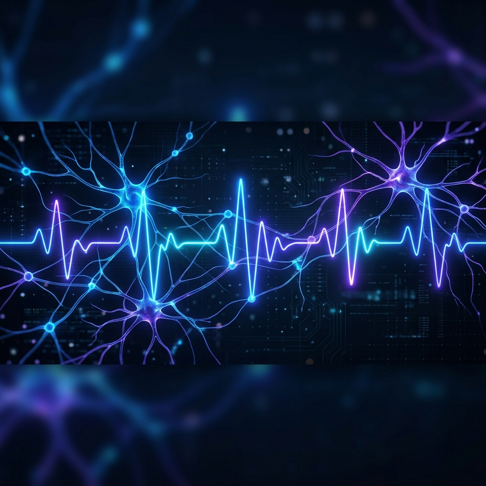
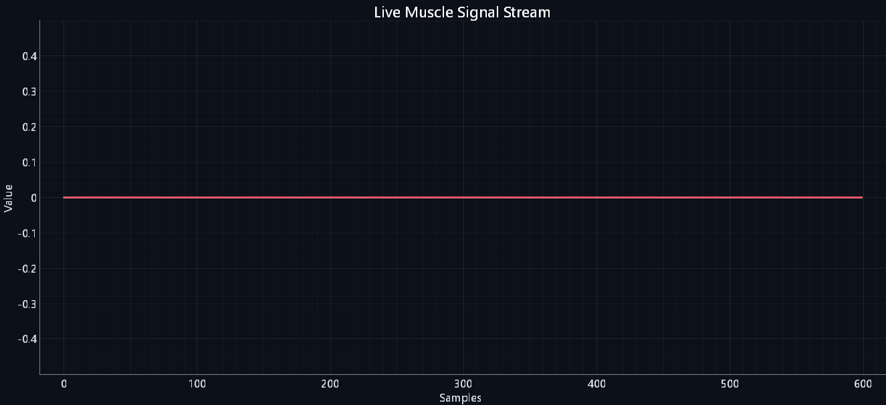

<div align="center">



# 🧠 NeuroPulseAI
### *The Ultimate Clinical-Grade EMG Monitoring & Analysis Suite*

[](https://www.python.org/)
[](https://reactjs.org/)
[](https://streamlit.io/)
[](https://opensource.org/licenses/MIT)

**NeuroPulseAI** is a high-performance ecosystem designed for real-time Electromyography (EMG) medical signal visualization, AI-driven analysis, and clinical patient management. 

[Explore the Web App](https://github.com/adityaiitian123/NeuroPulseAI/tree/main/neuropulse-web) • [View Plotter](https://github.com/adityaiitian123/NeuroPulseAI/blob/main/fast_plotter.py) • [Clinical Dashboard](https://github.com/adityaiitian123/NeuroPulseAI/tree/main/streamlit_emg_data)

---

</div>

## ✨ Key Features

| Feature | Description |
| :--- | :--- |
| **🚀 Pro Ultra Plotter** | 100+ FPS real-time serial plotting with zero latency using Pyqtgraph. |
| **🤖 AI Diagnostics** | Groq-powered AI analysis for muscle fatigue, movement patterns, and rehabilitation insights. |
| **🏥 Clinical CRM** | Complete patient profile management with history tracking and PDF report generation. |
| **🌐 Web Integration** | Modern, responsive React-based landing page for patient discovery and data overview. |
| **📊 Real-time Analytics** | Live FFT frequency analysis and statistical modeling of EMG signals. |

---

## 📸 Visual Overview

### 📈 High-Fidelity Signal Tracking
The **NeuroPulse Pro Ultra Plotter** provides ultra-smooth, clinical-grade visualization of EMG data directly from Arduino/Serial sensors.



---

## 🛠️ Technology Stack

- **Core Logic**: Python 3.10+
- **Visualization**: Pyqtgraph (Ultra-fast OpenGL rendering)
- **Clinical Dashboard**: Streamlit
- **Web Interface**: Vite + React + Vanilla CSS
- **AI Integration**: Groq LPU (Large Language Models for diagnostics)
- **Data Persistence**: JSON-based patient database

---

## 🚀 Getting Started

### 1️⃣ Clone the Repository
```bash
git clone https://github.com/adityaiitian123/NeuroPulseAI.git
cd NeuroPulseAI
```

### 2️⃣ Install Dependencies
```bash
pip install -r requirements.txt
```

### 3️⃣ Launch the Application Suite

*   **To run the Real-time Plotter:**
    ```bash
    python fast_plotter.py
    ```
*   **To launch the Clinical Dashboard:**
    ```bash
    streamlit run streamlit_emg_data/main.py
    ```
*   **To preview the Web Interface:**
    ```bash
    cd neuropulse-web
    npm install
    npm run dev
    ```

---

## 📁 Project Structure

```text
NeuroPulseAI/
├── assets/                  # High-quality UI/UX assets
├── neuropulse-web/          # Modern React-based marketing site
├── streamlit_emg_data/      # Clinical CRM & Patient Management
├── fast_plotter.py          # The high-performance signal engine
├── create_shortcut.py       # Desktop deployment utility
└── requirements.txt         # Project dependencies
```

---

<div align="center">

### Built for the future of Rehabilitation & Neuro-technology.
Created with ❤️ by [Aditya Kumar Singh](https://github.com/adityaiitian123)

</div>